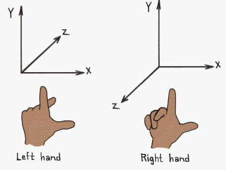

Before I implement the real code for dealing with receiving movement requests from the client and broadcasting movement updates
to affected clients, I want to take a step back and examine the problem of movement without network code. It's a surprisingly
tricky problem and ends up being one of the most fascinating and fun problems to solve in this MMO server journey.

If we think movement is easy, we're probably not thinking about it correctly. If we think movement is too hard to simulate in
a server, then we're _also_ not thinking about it correctly. So, as the influencers say ... _"let's unpack this"_

## Deciding Axis Orientation and Scale
We're going to be maintaining a server-side simulation of objects in space. These objects are 3-dimensional and they move according to _some subset_ of the standard model of physics. The server simulation doesn't need to be anywhere near the same fidelity as the client. On the client, projectiles will move ballistically. Objects will be affected by gravity. Forces will act on objects and those forces will be affected by friction and some other higher-level "physics" properties most engines support like bounciness, stickiness, and even whether or not the object will collide with other objects.

On the server, we don't have gravity or ballistic or parabolic interpolation. On the server, things have **position**, **velocity**, and **acceleration**. The client might request that those change, but the server's job is braindead simple compared to the client. This works out well for me, since on my better days I can surpass brain dead.

So what do our 3 axes look like? What _orientation_ are they in, and what scale is the universe? In other words, what does a position _mean_ in the real world and which direction are the axes facing? This is mostly an arbitrary choice. We can pick whatever orientation we want and we can choose whatever units we want. _However_, we can do our future selves a favor here and pick a very common orientation. 

For the rest of this post (and the eventual implementation), I'm going to use **_Y-up, right-handed_**.



Engines like **Unity** and **Unreal** use this orientation so I figure it will be easier for me to adopt this and probably avoid some foolish translation errors in the future. 

If the picture isn't something you can see, then to get the axis orientation: Hold your right hand up facing you, with your thumb pointed to the right. This is the **x** axis. Pointing your pointer finger up gives you the **y** axis (hence the name _y-up_). Point your ring finger toward you, and this is the **z** axis.

Axis orientation is something that usually confuses people new to this material. An object in this cartesian coordinate system will move _forward and back_ along the **z** axis, _up and down_ along the **y** axis, and _left and right_ along the **x** axis.

### Setting a Scale
So what does a point on this grid actually _mean_? Are these arbitrary units? Can we call them **McUnit**s? Thankfully smarter people have encountered this problem before and most of them have settled on a standard: _1 unit is 1 meter_. I know the use of metric might unnerve some Americans, but metric is just a much easier standard to deal with. So if something has moved (you'll see this called _translated_ if you're searching for background material) 3 units positively along the **y** axis, it has _gone up_ by 3 meters.

_Simple and sweet._

## Storing Positions
Storing positions is fairly easy. Any point in this cartesian coordinate system is a 3-tuple (the cool kids call them _"thruples"_), where the members are _x_, _y_, and _z_ respectively. 

In tuple notation, that means:

* `{0.0, 1.1, 2.0}` - A point at the X origin, 1.1 meters _up_, and _2.0_ meters _forward_ from the origin.
* `{50.0, 100.0, 150.0}` - A point further away from the origin.

There's an implicit decision being made here. _Where is the origin?_. Some people would be getting frustrated by now, but _I freaking love this stuff_. 

Since our Y axis goes up, we don't want the origin to be at the _top_, because that would make every single Y coordinate negative. That might not seem like a big problem, but not having variety of numbers can actually make some algorithms slower. 

So we will put our `{0, 0, 0}`  origin at the _center of the universe_. This might be the center of the entire known universe, or it might be the center of a _zone_ or _region_. The thing to remember is that _any_ of our coordinate systems (some may exist within others, which is a thing I'll discuss in another post) will treat the origin as the center.

## Basic Vector Math
Depending on what your college major was, or which cool classes you got in high school, or just which YouTube videos you've watched, you may have different exposure to and context surrounding the concept of _vectors_. Since I dropped out of university Computer Science, my point of reference for vectors is that in physics they're a "line" with direction and magnitude.

If you've used Rust or some other languages, you might already think of vectors (a `Vec<T>`) as a linearly arranged set of numbers.

We're starting to get to the point where we can reap the benefits of the elegance of solutions made by smarter people who came before us. Instead of treating a position as a "struct" or "record" with 3 fields (x,y, and z), we treat those thruples as vectors. 

Once we treat all these values as vectors, math becomes our best friend and everything turns rainbow colored and you can hear the songs of angels as you compile.

To move (remember, to sound smart, call this _translate_) from one position to another, all you have to do is _add_ vectors:

`new_location = old_location + direction_to_move`

That's it. Vectors have rules for adding (just add all the elements). Now before you start to go write your own vector library (because we know how absurdly fun that is), we don't have to build that. And before you complain that Elixir is slow at computationally expensive things, we have a solution to that problem as well.

Here's a sneak preview of just how elegant things look in vectorland. To figure out the new position of an object that is moving with a velocity `v`, we just add the velocity vector (your velocity is a 3D vector!) to the position vector, and get a new position vector:

`new_position = old_position + v`

So if an enemy starts at the origin and has a velocity vector of `{0.0, 1.0, 0.0}` and this velocity is in _meters per second_, then every second, the server will add the velocity vector to the position and update the position. After 3 seconds, this enemy will be at `{0.0, 3.0, 0.0}`. 

Deep thoughts: how would you deal with acceleration[^1], if it was measured in _meters per second squared_ or _meters per second per second_? That's right! You add the acceleration vector `a` to the velocity vector `v` to produce a new velocity every second. Is this stuff beautiful or what?

As for doing vector math for real, machine learning has delivered a gift unto our collective laps: _tensors_.

## Using Tensors
If you've heard of tensors before, you've probably heard of them in the context of machine learning. Tensors, in the mathematical sense, are more general than vectors. They are a way to generalize scalars, vectors, matrices, and higher-dimensional things into an array of numbers. No matter how many dimensions it has, a tensor is always an array.

Speaking of dimensions, this is one thing that confused the hell out of me at first. A _vector_ is actually just a specialized name for a 1d tensor. 

* 0-dimension tensor - **scalar**. This is a single number with no dimensions, e.g. 4 or 12 or 42.
* 1-dimension tensor - **vector**. This is an ordered list of numbers like `[1, 2, 3]`. 
* 2-dimension tensor - **matrix**. This is a grid of numbers arranged like a table. Programmers are pretty familiar with the notion of a two-dimensional array.
* n-dimension tensor - these are all tensors but don't have fancy names.

The confusing bit comes from two conflicting definitions of dimension. To represent a point in _3-dimensional_ space, we use an ordered list of numbers, which is a vector. A vector is a 1-dimensional tensor. So: 3-dimensional point, 1-dimensional tensor. That still bugs me even as I write this. Put another way, I can create a vector with 1,000 dimensions (list elements) and it's still only a 1-dimensional tensor.

Elixir has the amazing [Nx](https://hex.pm/packages/nx) package. While it might advertise itself as a tool for machine learning, we've already seen that tensors are generalized and flexible. This means we can take advantage of Nx's tensors in our server-side simulation. Even more importantly, **Nx** can actually create code that is _hardware accelerated_. Depending on what you're calculating and how, and your machine, it could calculate as fast as C.

Here's how to create a couple of tensors and use them for some basic movement calculations:

```elixir
position = Nx.tensor([0.1, 0.1, 0.0])
velocity = Nx.tensor([1.5, -2.0, 0.0])
dt = 0.1 # time step in seconds
new_position = Nx.add(position, Nx.multiply(velocity, dt))

#Nx.Tensor<
  f32[3]
  [0.6499999761581421, 0.30000001192092896, 0.0]
>

```
Here we're using `dt` to represent the time step ("delta time"). If velocity is measured in meters per second, then a server that _ticks_ 10 times per second will have a time delta of `0.1`. So, we scale or multiply the velocity by the time slice and then add that to the original position. The result is a new tensor. This new tensor is then available to our code to use as we wish.

If we just used this code in a giant loop for all of the objects in our universe simulation, it would work but it certainly wouldn't leverage any of the things that **Nx** (and tensors in general) is good at. In my first iteration of this, I did just that: called `map` on each position to produce a new position based on a velocity that I looked up.

This is just fine for simple "hello world" demos, but it's not going to cut it if I have tens of thousands of objects being modeled in the sim.

What if we created a tensor that held the positions of _every single object in the universe_:

```elixir
all_positions = Nx.tensor([
  [0.0, 0.5, 1.0],
  [0.3, 1.5, 2.0],
  [8.1, 30.5, 200.2],
  ...
])
```
Now we get back a tensor that has a "shape" of `f32[n][3]` where `n` is the number of elements/positions in the tensor.
Now let's get really crazy and define another tensor, `all_velocities`, that has the velocities of each object in the same order as the positions.

Now we can calculate the new positions of _every object in the universe_ in a single tensor addition command, which _can_ be hardware accelerated:

```elixir
new_positions = Nx.add(all_positions, all_velocities)
```

How fantastic is that?? I can likewise use a huge tensor addition to add `all_accelerations` to `all_velocities` prior to adding the velocities to the positions.

So this takes care of updating the properties of objects in the universe during each server tick, but there are still more difficult (fun!) problems to solve, like how to detect collisions and how to figure out which players get sent which movement notifications.

## Answering the Nearby Question with Spatial Indexes
When it comes to keeping track of objects in space, there are generally two questions that need to be answered during each tick:

* For each object, is it colliding with any other objects?
* For each object, what are all the "nearby" objects whose clients will be notified of movement and other changes?

The most brute force method would be to loop through all objects nested. In imperative programming that might look like this:

```c
for (sourceObject in allObjects) {
  for (targetObject in allObjects) {
     if sourceObject.colliding(targetObject) { ... }
     if targetObject.nearBy(sourceObject) { // send notification packet re: sourceObject
  }
}
```

Now let's assume we have 100,000 tracked objects in the simulation. This might be from 10,000 players and a bunch of other "stuff" that is collidable and detectable from a server simulation perspective. This nested loop would run `100_000 * 100_000` times, which is `10_000_000_000` (10 billion). I'm deliberately using some large numbers because I want to stress how important it is to fit all your calculations within the per-tick budget. If the server simulation is running at _10Hz_, then we have just _100ms_ to perform all the work that needs to be done during each tick.

As all the startups are fond of saying, _"Let's unpack this."_ A CPU running at 3.4GHz has 3.4 billion _cycles_ per second. If we assume 7 instructions per cycle (search engine tells me this is a safe estimate) then we have 23.8 billion instructions per second. Now let's cut that to 100ms (remember, the server ticks at 10Hz in this sample) and we get 2.3 billion instructions per second. So, quick napkin math tells me that we have 2.3 billion instructions to accomplish a loop over 10 billion items. That's pretty sketchy.[^2]

Now there's another concept to the rescue: the **_spatial index_**. A spatial index is what it sounds like - a quick-reference index of objects where the index is optimized to support spatial queries. There are a bunch of different kinds of spatial indexes, but one of the common ones you encounter in searches is the [R-tree](https://en.wikipedia.org/wiki/R-tree). An R-tree groups objects together in the index by their proximity to each other. 

With a spatial index of all our sim objects, we can ask questions like "what are all the objects within 1km of the source object", or you can check for collisions by asking the index for all objects that overlap with your object. We should also be able to do things like further filter by "tag" so we can ask for something like _all player-piloted ships within 1km of this space station". This list could then be used as targets for an update packet from the station like docking availability.

So I would imagine the implementation of this would involve some fast and easy way to retrieve the list of all accelerations, all velocities, and all positions. We could then use the spatial index to determine the list of recipients of an "object moved" packet. Combine this with the fact that we can use optimized tensors to perform the movement calculations with a single tensor `add`, and this is starting to look pretty cool. I bet we could then do a tensor `subtract` between the new positions and the old positions, so we could ignore objects that didn't move, avoiding the cost of building and sending those packets.

## Wrapping Up
This has been a lot of bloviating about a lot of theory and concepts. Usually I love to just spew code in a blog post, but I thought that there were so many extremely rich concepts just begging to be researched and explained that a pre-code post felt warranted. 

In my next post, I'll be summarizing my implementation of the movement simulation system in my real Elixir backend. Who knows, I could be wrong on all counts and it'll be a miserable failure. Experts will laugh at me and say, "You used tensors for a movement sim? What have you been smoking??" _Or_, maybe it'll be a good idea and I'll find out that I can indeed have 10,000 players in a single OTP application. I can't wait to find out!

---
[^1]: In Calculus speak, _velocity_ is the first derivative of the _position_ function. _Acceleration_ is the second derivative. And there's even a third derivative called _jerk_, which is the rate at which acceleration is changing.

[^2]: My math might also be sketchy. I am likely calculating things wrong here, but the core idea remains the same - we have a very limited budget of things we can do during just one server tick.
